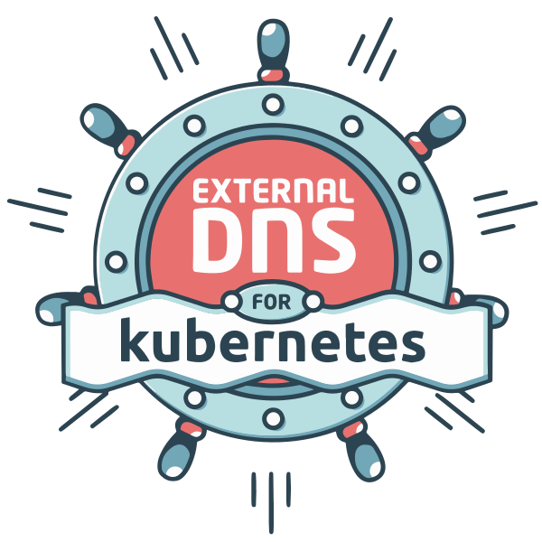

# Single-node cluster setup

> [!NOTE]
> Even though currently the scripts are set up for just a single node, all pieces of software are capable of setting up and running multiple control planes and worker nodes.
>
> If you run Traefik in HA, make sure to shift from built-in `certificatesResolvers` usage to `cert-manager`. I removed `cert-manager`, because I am unlikely to have multiple nodes (for now).

This repository contains multiple modules and scripts, that you can run manually to set up a homelab / NAS. The scripts are very opinionated and they work for me - feel free to change anything you might want or need.

## Table of Contents

- [BOM](#bom)
  - [Deployment](#deployment)
  - [System](#system)
  - [Orchestration, network and storage](#orchestration-network-and-storage)
  - [Security](#security)
  - [Database](#database)
- [Modules](#modules)
  - [Main modules](#main-modules)
  - [Common Modules](#common-modules)
  - [Legacy Modules (Not in Use)](#legacy-modules-not-in-use)
- [Scripts](#scripts)
  - [State management](#state-management)
  - [Terraform / cluster management](#terraform--cluster-management)

## BOM

Here's a list of all the software being used in this homelab setup:

 

### **Deployment:**

-  **[OpenTofu](https://opentofu.org/)** / **[Terraform](https://www.terraform.io/)** - Infrastructure provisioning
-  **[Helm](https://helm.sh/)** - Kubernetes package manager

### **System:**

-  **[Proxmox VE](https://www.proxmox.com/en/proxmox-virtual-environment/overview)**  - Virtualization platform
-  **[Talos Linux](https://www.talos.dev/)**  - Immutable Kubernetes OS
-  **[Alpine Linux](https://alpinelinux.org/)**  - Lightweight Linux distribution for containers

### **Orchestration, network and storage:**

-  **[Kubernetes](https://kubernetes.io/)**  - Container orchestration platform
-  **[Cilium](https://cilium.io/)**  - eBPF-based networking, observability, and security
-  **[Traefik](https://traefik.io/)**  - Modern reverse proxy and load balancer with automatic service discovery
-  **[Local Path Provisioner](https://github.com/rancher/local-path-provisioner)**  - Dynamic local storage provisioner
-  **[External DNS](https://github.com/kubernetes-sigs/external-dns)**  - Kubernetes addon to configure external DNS servers

### **Security:**

-  **[Step-CA](https://smallstep.com/certificates/)** CLI  / server  - Certificate authority for internal PKI
-  **[Zitadel](https://zitadel.com/)**  - Identity and access management platform

### Database

-  **[CloudNative-PG](https://cloudnative-pg.io/)**  - Kubernetes operator for PostgreSQL, used by Zitadel and other applications
- **[pgAdmin](https://www.pgadmin.org/)**  - Web-based PostgreSQL administration and management tool

## Modules

### Main modules

- **[`host`](modules/host/README.md)** - Configures the Proxmox host with required packages, users, storage pools, and system settings
  - **[`copy-configs`](modules/host/modules/copy-configs/README.md)** - Handles copying configuration files to the host
  - **[`directory-mappings`](modules/host/modules/directory-mappings/README.md)** - Maps directories for VirtioFS sharing with VMs
  - **[`packages`](modules/host/modules/packages/README.md)** - Installs additional APT packages on the host
  - **[`repositories`](modules/host/modules/repositories/README.md)** - Manages APT repositories (enables no-subscription repo)
  - **[`scripts`](modules/host/modules/scripts/README.md)** - Executes various non-interactive setup scripts
  - **[`share-user`](modules/host/modules/share-user/README.md)** - Creates a dedicated user for file sharing
  - **[`terraform-user`](modules/host/modules/terraform-user/README.md)** - Creates Terraform user and API token for Proxmox automation
  - **[`trust-proxmox-ca`](modules/host/modules/trust-proxmox-ca/README.md)** - Configures Proxmox to trust its own CA certificate
  - **[`zfs-storage`](modules/host/modules/zfs-storage/README.md)** - Imports and manages ZFS storage pools

- **[`stepca-lxc`](modules/stepca-lxc/README.md)** - Sets up Step-CA certificate authority in an Alpine LXC container for internal PKI management

- **[`cluster`](modules/cluster/README.md)** - Sets up the Talos Kubernetes cluster on Proxmox with networking (Cilium), ingress (Traefik), storage (local-path-provisioner), DNS (external-dns), database (CloudNative-PG), and platform applications
  - **[`talos-download-image`](modules/cluster/modules/talos-download-image/README.md)** - Downloads and manages Talos images for deployment
  - **[`talos-prepare-cluster`](modules/cluster/modules/talos-prepare-cluster/README.md)** - Prepares cluster by generating machine secrets and configurations
  - **[`talos-create-vm`](modules/cluster/modules/talos-create-vm/README.md)** - Creates Talos VMs on Proxmox with proper configuration
  - **[`talos-await-cluster`](modules/cluster/modules/talos-await-cluster/README.md)** - Waits for Talos cluster to become ready and available
  - **[`infrastructure`](modules/cluster/modules/infrastructure/README.md)** - Core cluster infrastructure components
    - **[`cilium`](modules/cluster/modules/infrastructure/modules/cilium/README.md)** - Installs Cilium CNI for eBPF-based networking, observability, and security
    - **[`traefik-crds`](modules/cluster/modules/infrastructure/modules/traefik-crds/README.md)** - Installs Traefik Custom Resource Definitions
    - **[`traefik`](modules/cluster/modules/infrastructure/modules/traefik/README.md)** - Installs Traefik v3 ingress controller with ACME support and OIDC capabilities
    - **[`external-dns`](modules/cluster/modules/infrastructure/modules/external-dns/README.md)** - Installs external-dns for automatic DNS record management
    - **[`local-path-provisioner`](modules/cluster/modules/infrastructure/modules/local-path-provisioner/README.md)** - Installs local-path-provisioner for dynamic local storage
    - **[`metrics`](modules/cluster/modules/infrastructure/modules/metrics/README.md)** - Cluster metrics configuration
  - **[`platform`](modules/cluster/modules/platform/README.md)** - Platform applications and services
    - **[`cnpg-operator`](modules/cluster/modules/platform/modules/cnpg-operator/README.md)** - Installs CloudNative-PG operator for PostgreSQL management
    - **[`zitadel`](modules/cluster/modules/platform/modules/zitadel/README.md)** - Deploys Zitadel identity and access management platform
    - **[`pgadmin`](modules/cluster/modules/platform/modules/pgadmin/README.md)** - Deploys pgAdmin for PostgreSQL administration

### Common Modules

- **[`common/modules/alpine`](modules/common/modules/alpine/README.md)** - Creates Alpine Linux LXC containers with SSH access and basic packages
- **[`common/modules/helm-terraform-installer`](modules/common/modules/helm-terraform-installer/README.md)** - Installs Helm charts through Terraform with namespace and manifest management

### Legacy Modules (Not in Use)

- **[`(not-in-use)lldap-lxc`](modules/(not-in-use)lldap-lxc/README.md)** - LLDAP lightweight directory service (deprecated)
- **[`(not-in-use)pihole-lxc`](modules/(not-in-use)pihole-lxc/README.md)** - Pi-hole DNS server (deprecated)

### Scripts

#### State management

- **[backup-state.sh](scripts/backup-state.sh)** - Backs up Terraform state files to a remote host via SSH/SCP. Useful for preserving infrastructure state before major changes.
  > **Usage:**<br/>
  > ```bash
  > ./backup-state.sh -d /remote/path [-s source_dir] [-h host] [-u user]
  > ```

- **[restore-state.sh](scripts/restore-state.sh)** - Restores Terraform state files from a remote host. Complements the backup script for disaster recovery.
  > **Usage:**<br/>
  > ```bash
  > ./restore-state.sh -d /remote/path [-h host] [-u user] [-o output_dir]
  > ```

#### Terraform / cluster management

- **[cleanup-cluster.sh](scripts/cleanup-cluster.sh)** - Completely removes cluster VMs from Proxmox and cleans up local Terraform files. Supports dry-run mode.
  > **Usage:**<br/>
  > ```bash
  > ./cleanup-cluster.sh PROXMOX_HOST [--dry-run] [--tf-path PATH]
  > ```

- **[generate-docs.sh](scripts/generate-docs.sh)** - Automatically generates README documentation for all Terraform modules using terraform-docs. Includes execution story generation.
  > **Usage:**<br/>
  > ```bash
  > ./generate-docs.sh [PATH]
  > ```

- **[story-plan.sh](scripts/story-plan.sh)** - Analyzes Terraform dependency graphs to show resource execution order. Supports both module-only and extended (resource-level) views.
  > **Usage:**<br/>
  > ```bash
  > ./story-plan.sh [-d|--debug] [-x|--extended] [-r|--raw] [-p|--path PATH] [-b|--binary BINARY]
  > ```
